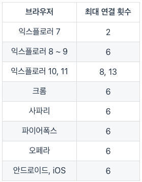

## webpack

- 빠른 로딩 속도 제공
- 로딩 속도를 줄이기 위한 방법중 대표적인게 브라우저에서 서버로 요청하는 파일 숫자를 줄이는 것이다.
- 웹팩은 첫 렌더링시 필요하지 않은 자원까지 요청하지 않고 해당 라우터에 방문했을 때 관련 자원을 요청한다.

## TCP/IP

### - IP
- data 조각들을 최대한 빨리 목적지로 보내는 역할, 조각들의 순서가 뒤바뀌거나 일부가 누락되더라도 크게 상관하지 않고 보내는데 집중
- 패킷 전달 여부를 보증하지 않고, 패킷을 보낸 순서와 받는 순서가 다를 수 있다.

### - TCP
- IP 위에서 동작하는 프로토콜로, 데이터의 전달을 보증학고 보낸 순서대로 받게 해준다.
- IP보다 느리지만 꼼꼼한 방식을 사용, 도착한 조각을 점ㄱ머하여 줄을 세우고 망가졌거나 빠진 조각을 다시 요청함
- HTTP, FTP, SMTP 등 TCP를 기반으로 한다.

## Problem To resolve with webpack

### 1. 자바스크립트 유효범위 
- 모듈 번들링으로 해결

### 2. 브라우저별 http 요청 숫자의 제약
- 웹팩으로 모듈을 번들링하면 http 요청 숫자 제약을 피할 수 있다.
- 

### 3. Dynamic Loading & Lazy Loading 미지원
- Code splitting 으로 원하는 모듈을 원하는 타이밍에 로딩